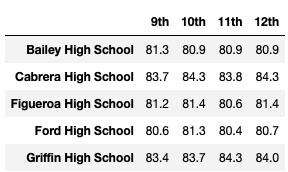
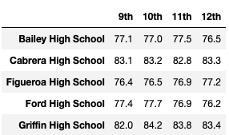
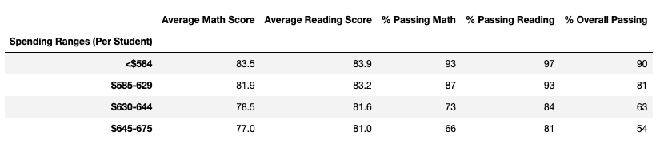
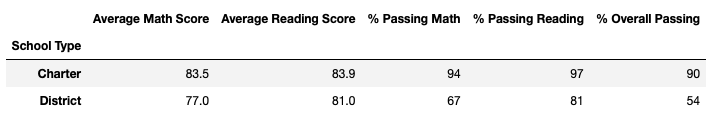
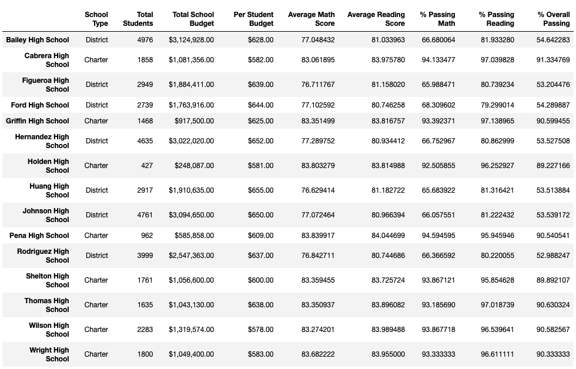

# School_District_Analysis

## Project Overview
The purpose of this analysis was to use the data provided by Maria to analyze the test performance trends among the schools in the district. We used the data to determine the highest passing rates by school, budget, school size and other factors.

## Resources
Data Source: clean_students_complete.csv 
Software: Python 3.8.5, Jupyter Notebook

## Results
### How are the school and district summaries affected?
The school and district summaries are mostly unchanged with the replacement of the ninth grade scores. The percentages for Thomas High School changed but replacing the ninth-graders’ math and reading scores did not cause Thomas High School to move up in ranking. How does replacing the ninth-grade scores affect the following:

### How does replacing the ninth-grade scores affect the following:
  * Math and Reading Scores by Grade: 
  There is no change to the top schools for math or reading grades.
  
  
  
  
  * Scores by School Spending: 
  The average math and reading scores at each school based on average student size and spending did not change after I replaced the ninth-grade scores. Thompson high school is in the $630-$644 spending range (per student) and the scores remained the same.
    
    
  
  * Scores by School Size: 
  The average math and reading scores also did not change when shown based on school size. 
  
  * Scores by School Type: 
  Replacing the ninth-grade scores did not affect the overall math and reading scores by school type. The replacement in ninth-grade scores from Thompson high school did not affect the scores for all charter or district schools as it was a minor change compared to the overall number of grades.
  
  
  
  
## Summary
The main changes are shown in the per_school_summary dataframe. When I replaced the ninth grade scores with the “NaN” value and updated the calculations to only use the scores from tenth to twelfth grade students, the average scores changed. The average math score decreased from 83.41 to 83.86. The average reading score increased from 83.85 to 83.9. The percentage of passing math scores decreased and passing reading scores both decreased. After replacing the ninth grade scores, the overall passing percentage decreased from 90.95% to 90.63%. Updating the data made the analysis correct, but didn’t greatly affect the scores. 

 
